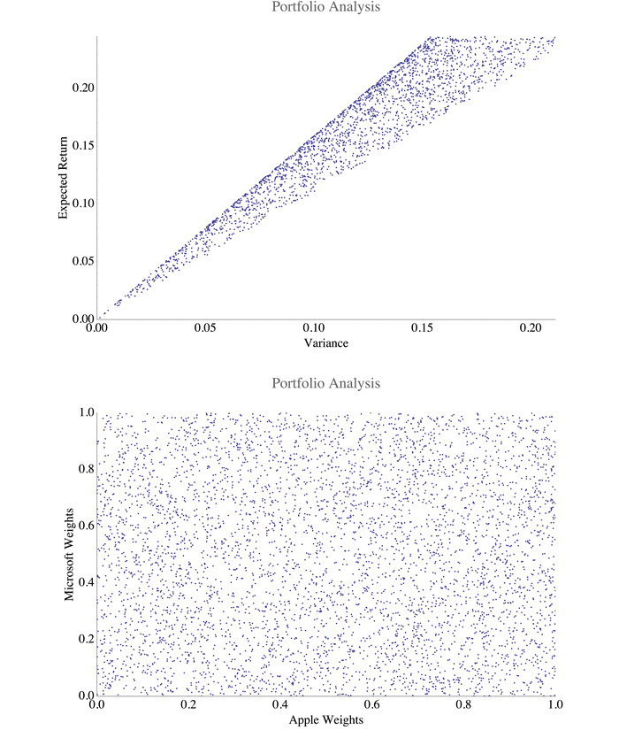

#PHY 250 Econophysics
##Final Project

Mikhail Gaerlan 
17 March 2017

---

A two-stock portfolio of Microsoft and Apple was analyzed in this project. The expected return of the portfolio was calculated by

$E(R _p)=\sum _i w _i E(r _i)$

and the variance was calculated by 

$\sigma^2 _p=\sum _i w _i^2\sigma _i^2+\sum _i \sum _{j\neq i}w _i w _j\sigma _i\sigma _j\rho _{ij}$

where $\rho _{ij}$ is the correlation coefficient between the two stocks. The following result is the progression of the genetic algorithm converging on the efficient frontier.

---

