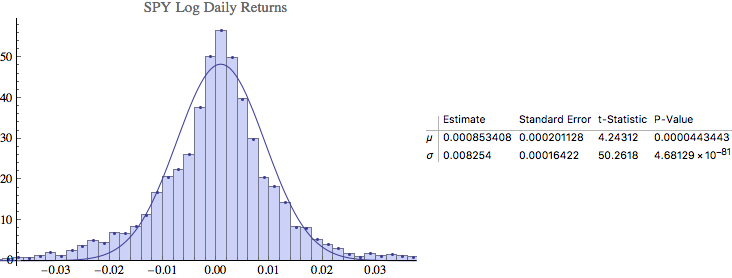
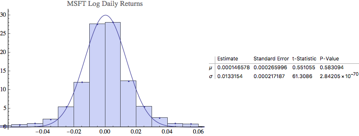
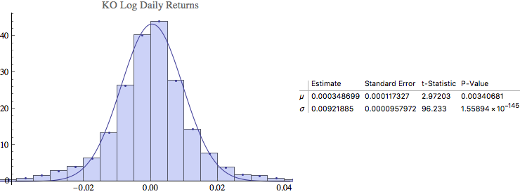
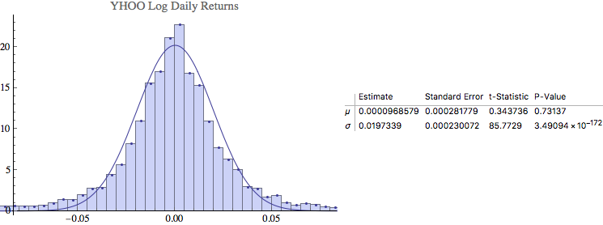

#PHY 250 Econophysics
##Project 4

Mikhail Gaerlan 
24 February 2017

---

The log daily returns are clearly Leptokurtoric given that the tail ends are always greater than the best-fitting Gaussian.

