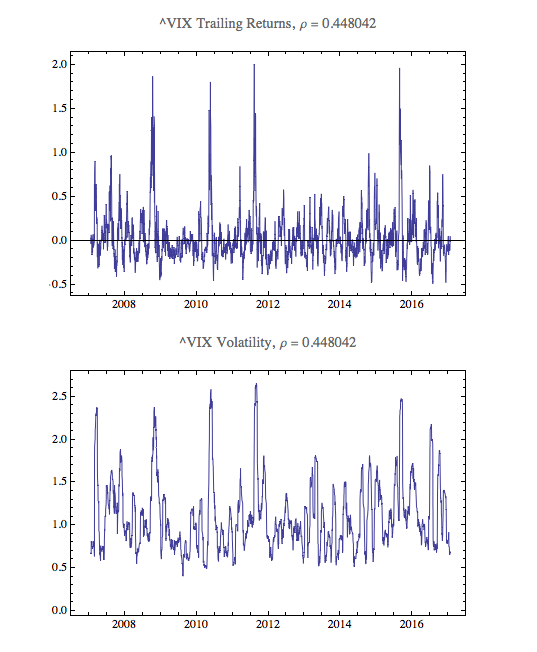
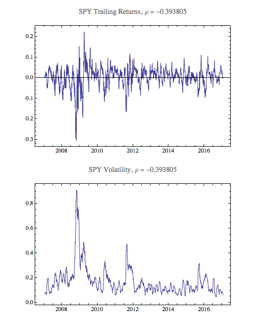
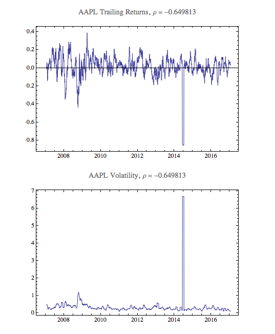
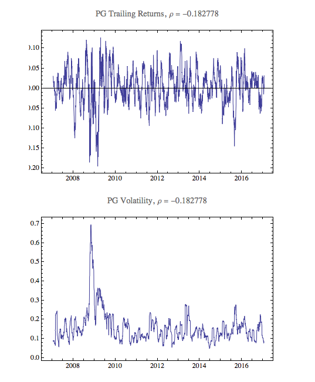
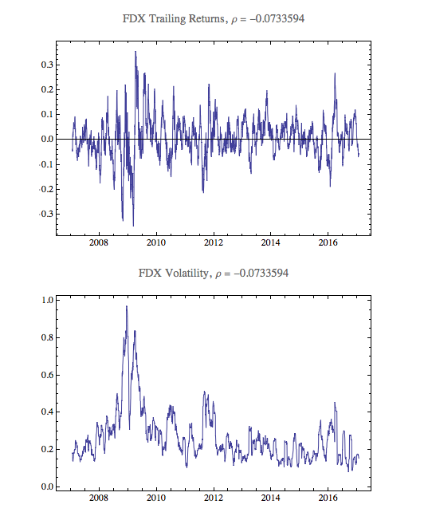
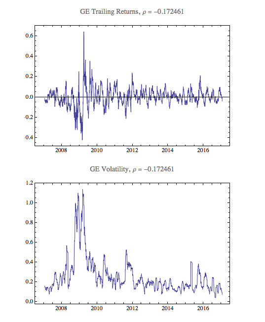

#PHY 250 Econophysics
##Project 5

Mikhail Gaerlan 
10 March 2017

---

The sign of the computed correlation coefficients correspond to changes in the volatility and returns. For example, most of the stocks with a negative correlation coefficient have negative returns with high volatility.

---

---

---

---

---

